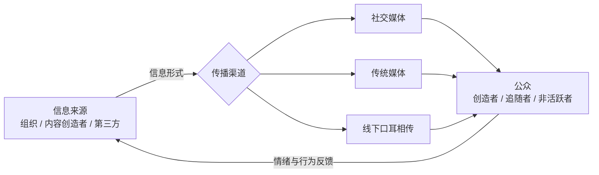

# 69社会化媒介危机传播模型（SMCC）

> 姓名：黄俊杰
> 学号：202418093017
> 词条序号：69
> 核心作者：Brooke Fisher Liu、Yan Jin、Lucinda Austin

---

## 一、定义名词

社会化媒介危机传播模型（Social-Mediated Crisis Communication Model，简称 SMCC）是传播学与公共关系研究中解释"社交媒体时代危机信息如何被寻求、分享与扩散"的理论模型。其核心观点是：**危机信息并非由组织单向"发布"给公众，而是处在由社交媒体、传统媒体与线下口耳相传共同构成的信息生态系统中，被不同主体不断创造、消费与再传播；公众从"谁"那里、通过"什么渠道"获取危机信息，会显著影响其情绪、归因与后续行为**[1]。

Austin、Liu 和 Jin 于 2012 年在《Journal of Applied Communication Research》发表的论文中正式提出该模型[1]。

通俗地说，SMCC 回答三个问题：

1. 危机发生时，公众最先从哪里获取信息（社交媒体、传统媒体还是线下口碑）？
2. 公众更信任谁的信息（组织、意见领袖还是普通网友）？
3. 不同的"渠道—来源—内容"组合如何影响公众的情绪、转发与口碑行为？

用一个日常情境来理解：某连锁餐饮品牌被曝后厨卫生问题。一位顾客可能从微博热搜（社交媒体渠道）第一次得知消息，随后看到美食博主的点评（内容创造者来源）和主流媒体的调查报道（传统媒体渠道），再在家庭群里转发讨论（线下口耳相传）。组织即使第一时间发布官方声明，也仅是众多信息来源之一。

**需要区分两个层面**：

| 层面 | 核心问题 | 示例 |
| --- | --- | --- |
| 信息层面 | 危机信息通过什么形式（渠道）、来自什么来源、包含什么内容 | "官方微博声明"（社交媒体 + 组织来源）；"博主曝光帖"（社交媒体 + 第三方来源） |
| 行为层面 | 公众基于上述渠道与来源，产生怎样的信息寻求、转发与口碑行为 | 转发官方声明、扩散曝光帖、向亲友求证 |

**注意事项**：模型描述的是"信息如何流动"以及"公众如何反应"，不能单凭模型推断组织声誉一定受损或恢复；组织声明只是信息源之一，不能替代对渠道使用与来源数据的分析。

## 二、背景和上下文

### 2.1 理论提出的背景

Web 2.0 时代之前，危机沟通研究的主流是 Coombs 提出的情境危机传播理论（SCCT）。SCCT 以归因理论为基础，指导组织根据危机类型与责任归因选择回应策略，但媒介渠道并未成为模型的核心变量[2]。

随着微博、Facebook 等社交媒体的兴起，危机信息往往先于传统媒体报道在社交媒体上引爆，公众获取信息的渠道结构发生了根本性改变。2010 年，Jin 和 Liu 提出博客中介危机沟通模型（BMCC），将有影响力的外部博客纳入危机沟通的核心分析框架；2012 年，Austin、Liu 和 Jin 将其扩展为涵盖微博、社交网站等多种社交媒体形态的 SMCC 模型[3][1]。

### 2.2 从传统媒体到社交媒体：渠道为什么重要

社交媒体从根本上改变了危机沟通过程中"内容创造者"与"内容消费者"之间的权力结构：普通公众既是信息的生产者、传递者，也是消费者。已有综述指出，危机发生后公众的社交媒体使用率明显提高，甚至对社交媒体报道的信赖程度有时高于传统媒体[2]。

传统媒体与社交媒体的关系也发生了变化：

- 社交媒体是危机信息首发与扩散的主场（第一落点）；
- 传统媒体仍具有权威性与议程设置能力（二次放大）；
- 线下口耳相传（口碑）构成舆论场域的基础动力。

### 2.3 应用领域与重要性

SMCC 广泛应用于：

- 企业危机公关：产品质量问题、高管不当言论、食品安全事件；
- 政府与公共部门应急沟通：公共卫生事件、自然灾害、政策争议；
- 旅游与目的地舆情危机；
- 灾害救援沟通：如与美国红十字会合作开展的灾害沟通研究。

其重要性在于：组织若不理解公众"从哪里获取信息、信任谁的信息"，再好的回应策略也可能在错误的渠道上失效。SMCC 为舆情监测与分析提供了一个"以公众为中心"的分析起点：先弄清信息生态，再谈应对策略。

## 三、举例说明

### 3.1 教学示例：某连锁餐饮品牌后厨卫生舆情

假设某连锁餐饮品牌被曝后厨卫生问题，组织、内容创造者与传统媒体分别通过不同渠道发布信息，公众的典型反应如下表：

| 信息形式 | 信息来源 | 信息内容 | 公众的典型反应 |
| --- | --- | --- | --- |
| 社交媒体 | 内容创造者（美食博主） | 曝光视频（情绪化叙述） | 高转发、高评论、愤怒情绪聚集 |
| 社交媒体 | 组织（官方微博） | 道歉声明 + 整改措施（指导性 + 调整性信息） | 部分缓解，但真实性仍被质疑 |
| 传统媒体 | 第三方（主流媒体） | 调查报道、专家访谈 | 议程放大，舆论进入爆发阶段 |
| 线下口耳相传 | 亲友 | 二次转述与讨论 | 扩散到社交媒体非活跃用户群体 |

> 本表是教学用示意，用于展示"渠道—来源—内容—反应"的对应关系，不代表任何真实事件的数据。

从上表可以看出：**同样是"道歉"内容，由组织通过社交媒体渠道发布与由第三方渠道转述，公众的信任程度与情绪反应不同**。这正是 SMCC 强调"渠道与来源独立于内容而起作用"的含义。

### 3.2 真实案例：上海迪士尼乐园"禁带饮食被告事件"

2019 年，上海迪士尼乐园因"禁带饮食、翻包检查"被大学生起诉，事件在微博等社交媒体迅速发酵。基于 SMCC 的分析表明：由"口碑"构成的舆论场域为危机提供了基本动力来源；有影响力的社交媒体内容创造者与公众形成舆论合意空间；主流媒体通过议程设置推动危机进入爆发阶段；而园区采用防御型信息策略、回避核心问题，导致舆论压力持续升级[4]。

用 SMCC 解读：组织的官方声明只是众多信息来源之一，第三方来源（意见领袖、媒体、公众）通过社交媒体渠道传播的信息主导了舆论走向——这正是该模型强调"不能只分析机构声明"的原因。

### 3.3 对比示例：组织"只发声明"为何可能失败

假设某企业面对危机只通过官网与新闻发布会回应，忽略社交媒体上的质疑与二次传播：

- 信息形式单一（仅组织渠道），第三方来源缺席；
- 公众在社交媒体上的疑问得不到回应，形成"信息真空"；
- 内容创造者继续主导叙事，组织逐渐丧失话语权。

该示例说明：渠道单一、来源缺失会使组织声明被淹没。SMCC 视角下的有效应对是"多渠道监测 + 多来源回应 + 匹配的内容类型"。

## 四、对比分析

### 4.1 与 SCCT、形象修复理论的对比

| 维度 | SMCC | SCCT | 形象修复理论（IRT） |
| --- | --- | --- | --- |
| 核心问题 | 公众从谁、通过什么渠道获取与分享危机信息 | 组织根据什么情境选择什么回应策略 | 组织用什么修辞策略修复受损形象 |
| 分析中心 | 信息生态系统（渠道 + 来源 + 公众） | 危机类型与责任归因 → 策略匹配 | 事后回应话语的策略分类 |
| 媒介地位 | 核心变量 | 非核心要素 | 基本不涉及 |
| 理论基础 | 公共关系、传播学、新媒体研究 | 归因理论 | 修辞学、辩解理论 |
| 适用场景 | 舆情监测、渠道与来源数据分析 | 危机策略选择与效果预测 | 危机回应文本编码分析 |
| 不能直接推出的结论 | 渠道一定决定组织声誉 | 选择了适配策略必然成功修复声誉 | 使用了修复策略等于形象已恢复 |

**SMCC 与 SCCT**：SCCT 回答"说什么"，SMCC 回答"通过谁说、在哪说、公众怎么听"。两者互补而非替代，SMCC 可视为对 SCCT 在社交媒体时代的补充与扩展[2]。

### 4.2 与两级传播理论的对比

两级传播理论强调"意见领袖 → 普通受众"的单向影响；SMCC 将主体细化为有影响力的内容创造者、追随者、非活跃者三类，并纳入传统媒体与线下口耳相传，形成多形式、多来源、带反馈回路的互动网络。两者的区别如下：

| 理论 | 主体 | 传播方向 | 媒介范围 |
| --- | --- | --- | --- |
| 两级传播 | 意见领袖与普通受众 | 自上而下、单向 | 以人际传播与大众传播为主 |
| SMCC | 创造者、追随者、非活跃者 | 多向、带反馈回路 | 社交媒体 + 传统媒体 + 线下口碑 |

## 五、深入扩展

### 5.1 模型的构成要素

SMCC 由三类核心要素构成，并包含反馈回路。

**（1）三类公众主体**

| 主体类型 | 行为特征 | 示例 |
| --- | --- | --- |
| 有影响力的社交媒体内容创造者（Influential Social Media Creators） | 主动创造危机信息，影响力大 | 意见领袖、大V、主流媒体账号、权威机构账号 |
| 社交媒体追随者（Social Media Followers） | 直接消费创造者信息，通过转发、评论、点赞参与传播 | 关注事件进展的活跃用户 |
| 社交媒体非活跃者（Social Media Inactives） | 不直接关注创造者，只接触经多次转发、修改后的信息，敏感度较低[5] | 主要通过亲友转述或传统媒体了解事件的用户 |

**（2）三类信息形式与信息来源**

- 信息形式（form）：社交媒体、传统媒体、线下口耳相传（Word-of-Mouth，WOM）；
- 信息来源（source）：组织自身、有影响力的社交媒体内容创造者、第三方（传统媒体与其他公众）。

**（3）信息内容类型**

| 内容类型 | 功能 | 示例 |
| --- | --- | --- |
| 指导性信息（Instructing Information） | 指导公众如何保护自身安全 | 疏散指引、产品召回信息 |
| 调整性信息（Adjusting Information） | 提供情感支持与心理调适 | 道歉、同情表达、心理援助渠道 |
| 声誉管理信息（Reputation Management Information） | 维护与重建组织声誉 | 整改承诺、第三方背书 |

**（4）反馈回路**

公众对信息的情绪与行为（转发、评论、口碑）会反馈影响信息来源与渠道的后续传播，使模型呈现动态循环，而不是一次性的单向传播：

### 5.2 模型逻辑的数学表达

SMCC 的核心逻辑可用函数形式概括为：

$$
C_i = f(F_i,\ S_i,\ M_i,\ P_i)
$$

各符号的含义如下：

| 符号 | 含义与解释 |
| --- | --- |
| $C_i$ | 公众 $i$ 的危机传播行为（信息寻求、转发、口碑等） |
| $F_i$ | 信息形式：社交媒体、传统媒体或线下口耳相传 |
| $S_i$ | 信息来源：组织、内容创造者或第三方 |
| $M_i$ | 信息内容类型：指导性、调整性或声誉管理信息 |
| $P_i$ | 公众个体特征：媒介使用习惯、卷入度、信任水平等 |

该式表达的含义是：**公众的危机传播行为同时取决于"渠道、来源、内容、受众"四类因素，而非仅取决于组织发布的信息内容**[5]。

渠道与来源的匹配还会影响公众的情绪与责任归因：

$$
\Delta A_{public} \propto \phi(S,\ F,\ origin)
$$

其中，$A_{public}$ 表示公众的归因性负面情绪（如愤怒、轻蔑、厌恶），$origin$ 表示危机起源（内源性或外源性）。研究表明：当危机属于内源性（组织自身导致）时，若信息经第三方社交媒体渠道传播，公众的归因性负面情绪会被显著放大；当公众将危机视为外源性时，若信息由组织渠道发布，公众更可能接受组织的回应[6]。

### 5.3 在新闻与舆情数据学中如何应用

SMCC 为舆情数据分析提供了一个可操作的框架：**用渠道使用数据与来源数据刻画信息生态，用内容编码刻画信息类型，用行为数据刻画公众反应**。

**第一，采集渠道与来源数据**。从微博、微信、抖音等平台抓取危机事件相关帖文，标注每条信息的发布渠道（社交媒体/传统媒体账号/线下转述）与来源类型（组织/内容创造者/第三方）。不能只采集组织官方账号发布的声明。

**第二，编码信息内容**。按指导性、调整性、声誉管理三类内容对文本编码，统计各类型内容的占比与发布时间线，观察组织是否在"指导公众安全"之外提供了足够的情感支持。

**第三，测量公众反应**。分别测量：情绪倾向（正面/负面/中性）、行为强度（转发/评论/点赞）、口碑扩散（跨平台转载与线下讨论的间接证据）。以"渠道 × 来源"为分组，比较不同组合下公众反应的差异。

**第四，注意可检验边界**。词频、情绪分类与转发网络可以提供背景与候选线索，但它们不能自动生成"公众最信任谁"的判断；转发量不等于说服效果，需要结合来源可信度与公众调查数据相互印证[5]。

### 5.4 使用边界与常见误解

**一是不能只分析机构声明**。SMCC 的应用边界在于研究"公众从谁、通过何种渠道寻求和分享危机信息"，因此必须结合渠道使用数据与来源数据；组织声明只是信息源之一[5]。

**二是模型描述信息流动，不直接预测声誉结果**。SMCC 侧重刻画信息如何产生、寻求与扩散，对组织声誉受损程度等结果变量的刻画相对有限；评估声誉需要结合其他理论（如 SCCT）与声誉测量数据。

**三是渠道使用不等于传播效果**。公众从社交媒体获取信息，不等于社交媒体上的信息必然改变其态度；转发量、阅读量是行为线索，不能直接等同于说服效果。

**四是不同平台逻辑存在差异**。微博、微信、抖音的传播机制不同（广场式公开传播、圈层式私域传播、算法推荐分发），应用模型时需结合具体平台情境检验。

**五是模型是分析框架，不是万能工具**。SMCC 帮助研究者"看清信息生态"，但不能代替对具体措施（是否提示、限流、删除）的价值判断与事实核查。

## 六、简明总结

SMCC 是社交媒体时代的危机沟通理论，核心问题是"公众从谁、通过什么渠道寻求和分享危机信息"。

1. 模型将主体分为有影响力的内容创造者、追随者、非活跃者三类，将形式分为社交媒体、传统媒体与线下口耳相传三类，并强调来源、形式与内容的匹配。
2. 与 SCCT、形象修复理论相比，SMCC 将渠道与来源提升为核心变量，回答"怎么说、在哪说、谁在传"。
3. 实践中，组织应持续监测多渠道、多来源的危机信息，结合渠道与来源数据制定回应策略，而非只盯着自己的声明。
4. 应用中应注意其边界：模型刻画信息流动而非声誉结果；渠道使用不等于传播效果；不同平台的传播逻辑需要单独检验。

**只有信息流数据，就描述信息生态；具备来源与渠道数据，才能分析公众的信息寻求；具备独立的行为与态度数据，才能检验危机传播的效果**。

## 七、参考文献

[1] Austin L, Liu B F, Jin Y. How audiences seek out crisis information: Exploring the social-mediated crisis communication model[J]. Journal of Applied Communication Research, 2012, 40(2): 188-207. [DOI](https://doi.org/10.1080/00909882.2012.654498).

[2] 钟伟军, 黄怡梦. 社交媒体与危机沟通理论的转型：从SCCT到SMCC[J]. 电子科技大学学报社科版, 2016, 18(5): 12-16. [DOI](https://doi.org/10.14071/j.1008-8105(2016)05-0012-05).

[3] Jin Y, Liu B F. The blog-mediated crisis communication model: Recommendations for responding to influential external blogs[J]. Journal of Public Relations Research, 2010, 22(4): 429-455. [DOI](https://doi.org/10.1080/10627261003801420).

[4] 蔡礼彬, 王飞. 基于SMCC理论的旅游网络舆情危机传播机理分析——以上海迪士尼乐园禁带饮食被告事件为例[J]. 旅游导刊, 2020, 4(5): 60-78. [文章链接](https://lydk.bisu.edu.cn/EN/Y2020/V4/I5/60).

[5] Liu B F, Jin Y, Austin L L. The tendency to tell: Understanding publics' communicative responses to crisis information form and source[J]. Journal of Public Relations Research, 2013, 25(1): 51-67. [DOI](https://doi.org/10.1080/1062726X.2013.739101).

[6] Jin Y, Liu B F, Austin L L. Examining the role of social media in effective crisis management: The effects of crisis origin, information form, and source on publics' crisis responses[J]. Communication Research, 2014, 41(1): 74-94. [DOI](https://doi.org/10.1177/0093650211423918).

